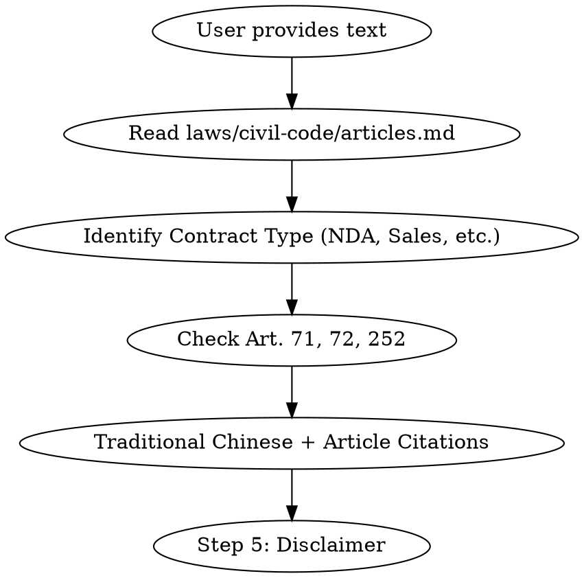

# Skill: Taiwan Legal Audit

## Overview
Provides a structured, high-fidelity legal audit of contracts and documents based on the Taiwan Civil Code and local legal practices.

## When to Use
- Reviewing NDAs, Employment Contracts, or Service Agreements.
- Checking if a clause violates mandatory provisions (Art. 71).
- Assessing liquidated damages risk (Art. 252).
- Evaluating compliance with Taiwan public order or good morals (Art. 72).

## Audit Workflow

### 1. Context Loading
**REQUIRED:** You MUST read `laws/civil-code/articles.md` if it is not already in your context before providing the audit. Do not rely on general knowledge.

### 2. Mandatory Risk Scan (Crucial)
Specifically audit for the following:
- **Art. 71 (Mandatory Provisions)**: Is the clause "void" because it violates a mandatory or prohibitive provision of the law?
- **Art. 72 (Public Order/Morals)**: Does the clause violate public order or good morals?
- **Art. 252 (Liquidated Damages)**: Is the penalty disproportionately high? Remind the user that courts may reduce it.

### 3. Output Requirements
- **Language**: Strictly use Traditional Chinese (Taiwan).
- **Citations**: Format as "依據民法第 XX 條...".
- **Disclaimer**: Every response MUST end with:
  > *注意：以上分析僅供參考，不構成正式法律意見。實際法律行為請諮詢專業律師。*

## Common Mistakes
- Skipping the explicit reading of `articles.md`.
- Giving definitive legal advice without the disclaimer.
- Using Simplified Chinese or non-Taiwan terminology (e.g., using "合同" instead of "合約").

## Example
**User**: "幫我看看這條：『乙方若遲延交付，應支付標的總額之 10 倍作為違約金。』"
**AI**: "根據您的描述，這涉及違約金的約定。
1. **分析**：此條文約定之違約金高達總額 10 倍。
2. **法律依據**：依據**民法第 252 條**：『約定之違約金額過高者，法院得減至相當之數額。』
3. **建議**：實務上此倍數可能被視為過高，建議調整或注意法院酌減風險。

*注意：以上分析僅供參考，不構成正式法律意見。實際法律行為請諮詢專業律師。*"
