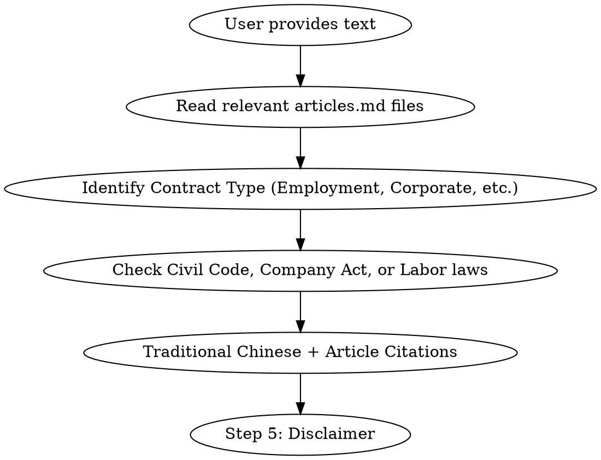

# Skill: Taiwan Legal Audit

## Overview
Provides a structured, high-fidelity legal audit of contracts and documents based on Taiwan laws (Civil Code, Company Act, Labor Standards Act) and local legal practices.

## When to Use
- Reviewing NDAs, Employment Contracts, Service Agreements, or Shareholder Agreements.
- Checking compliance with Labor Standards Act for employee-related clauses.
- Checking Company Act compliance for corporate governance or share-related matters.
- Assessing mandatory provisions (Art. 71) and liquidated damages (Art. 252) under Civil Code.

## Audit Workflow

### 1. Context Loading
**REQUIRED:** You MUST read the relevant `articles.md` files from `laws/` based on the document type:
- **General Contracts**: `laws/civil-code/articles.md`
- **Employment/Labor**: `laws/labor-standards-act/articles.md` (and Civil Code)
- **Corporate/Shares**: `laws/company-act/articles.md` (and Civil Code)

### 2. Multi-Law Risk Scan (Crucial)
Specifically audit for the following:
- **Civil Code Art. 71**: Violation of mandatory or prohibitive provisions.
- **Civil Code Art. 252**: Disproportionate liquidated damages.
- **Labor Standards Act**: Mandatory protection for employees (e.g., severance, working hours, termination notice).
- **Company Act**: Procedures for share transfers, board resolutions, or shareholder rights.

### 3. Output Requirements
- **Language**: Strictly use Traditional Chinese (Taiwan).
- **Citations**: Format as "依據[法規名稱]第 XX 條..." (e.g., 依據民法第 71 條, 依據勞動基準法第 11 條).
- **Disclaimer**: Every response MUST end with:
  > *注意：以上分析僅供參考，不構成正式法律意見。實際法律行為請諮詢專業律師。*

## Common Mistakes
- Skipping the explicit reading of relevant `articles.md` files.
- Mixing up laws (e.g., applying Civil Code where Labor Standards Act takes precedence).
- Using non-Taiwan terminology (e.g., using "合同" instead of "合約").

## Example (Labor)
**User**: "公司說如果不提早三個月預告離職，就要扣我最後一個月的薪水，這合法嗎？"
**AI**: "根據您的描述，這涉及離職預告期間與薪資扣留。
1. **分析**：雇主不得預扣勞工工資作為違約金或賠償費用。
2. **法律依據**：
   - 依據**勞動基準法第 26 條**：『雇主不得預扣勞工工資作為違約金或賠償費用。』
   - 關於預告期間，依據**勞動基準法第 15 條**與**第 16 條**，勞工年資不同有不同預告期，但契約約定長於法律規定的部分通常無效。
3. **建議**：公司扣發全月薪水的做法可能違反勞基法第 26 條。

*注意：以上分析僅供參考，不構成正式法律意見。實際法律行為請諮詢專業律師。*"
